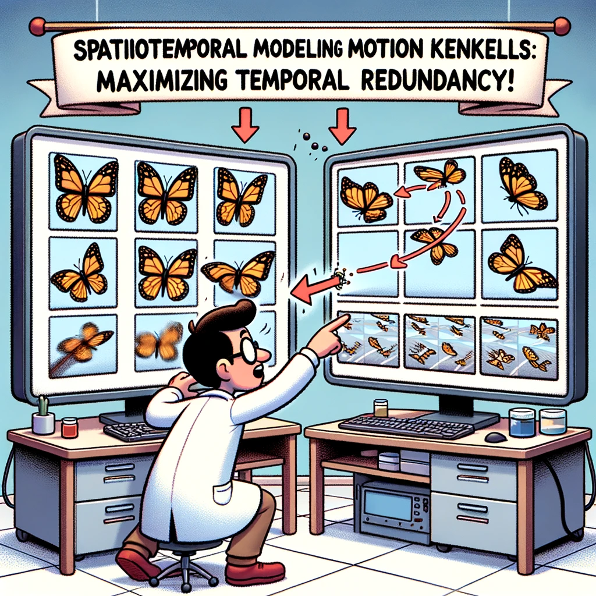
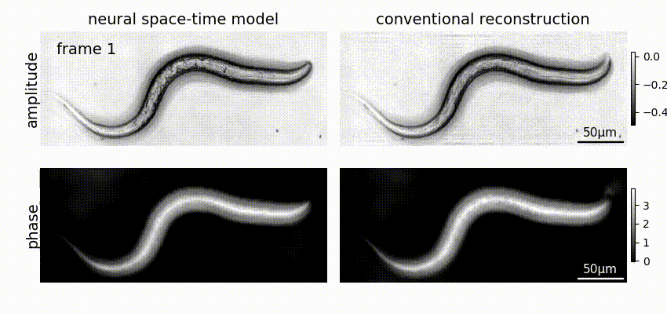
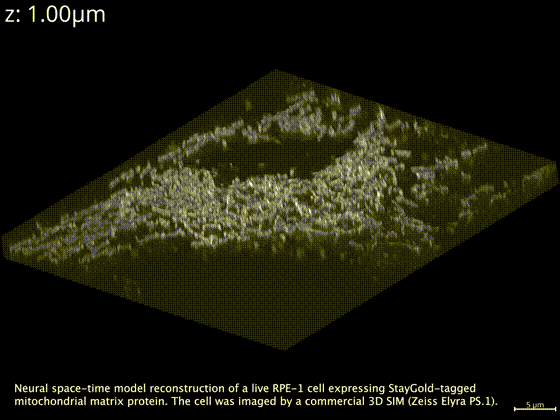

# 🚀⏱️ Neural Space-time Model for dynamic multi-shot imaging
<p align="center">

</p>

<p align="center">
    <a style="text-decoration:none !important;" href="https://doi.org/10.5281/zenodo.12786083" alt="DOI"></a>
    <a style="text-decoration:none !important;" href="https://nstm.readthedocs.io/en/latest/" alt="documentation"> </a>
    <a style="text-decoration:none !important;" href="https://www.biorxiv.org/content/10.1101/2024.01.16.575950" alt="paper"> </a>
    <a style="text-decoration:none !important;" href="https://opensource.org/licenses/BSD-3-Clause" alt="License"></a>
</p>


**_Neural space-time model (NSTM)_** is a computational image reconstruction framework that can jointly estimate the scene and its motion dynamics by modeling its spatiotemporal relationship, _without data priors or pre-training_. 
It is especially useful for multi-shot imaging systems which sequentially capture multiple measurements and are susceptible to motion artifacts if the scene is dynamic. 
Neural space-time model exploits the temporal redundancy of dynamic scenes. This concept, widely used in video compression, assumes that a dynamic scene evolves smoothly over adjacent timepoints.
By replacing the reconstruction matrix, neural space-time model can remove motion-induced artifacts and resolve sample dynamics, from the same set of raw measurements used for the conventional reconstruction.

The usage of NSTM is demonstrated through three example imaging systems: differential phase contrast microscopy, 3D structured illumination microscopy, and rolling-shutter DiffuserCam. 
And there's [a guide to incorporate NSTM into your own imaging system](https://nstm.readthedocs.io/en/latest/nstm_on_new_system.html)!

**See the full documentation [here](https://nstm.readthedocs.io/en/latest/) and the original paper [here](https://www.biorxiv.org/content/10.1101/2024.01.16.575950).**

Demo on DPC: [](https://colab.research.google.com/drive/1QNcRaNjG1CG58ffUURnYPWeIZMuuidZI?usp=sharing)

Demo on SIM: [](https://colab.research.google.com/drive/1rxRBrBgQgedR4DW7wITcdJVFVCqC0dcQ?usp=sharing)

## Installation

```
# Create conda environment
conda create -n nstm python=3.9
conda activate nstm

# Clone this project to your local machine.
git clone https://github.com/rmcao/nstm.git

# Install CUDA and cuDNN in conda virtual env
conda install -c conda-forge cudatoolkit~=11.8.0 cudnn~=8.8.0
conda install -c "nvidia/label/cuda-11.8.0" cuda-nvcc

# Install jaxlib for GPU
pip install jaxlib==0.3.18+cuda11.cudnn82 -f https://storage.googleapis.com/jax-releases/jax_cuda_releases.html

# (optional) Install dependencies for interactive visualization via Jupyter lab
conda install -c conda-forge jupyterlab nodejs ipympl

# Install a helper library and this codebase
pip install git+https://github.com/rmcao/CalCIL.git
pip install -e ./nstm
```

Note that the above command are for CUDA 11.x and cuDNN 8.2+. If you have different versions of CUDA, please refer to [JAX installation guide](https://jax.readthedocs.io/en/latest/installation.html) and make sure to match the version numbers of jaxlib and jax (as specified in requirements.txt).

## Application on Differential Phase Contrast Microscopy (DPC)
Locally run the step-by-step example in [this Jupyter notebook](examples/notebook-DPC.ipynb) or run on Google Colab [](https://colab.research.google.com/drive/1QNcRaNjG1CG58ffUURnYPWeIZMuuidZI?usp=sharing)
   ```
   jupyter lab --notebook-dir=./nstm/examples
   ```



## Application on 3D Structured Illumination Microscopy (SIM)

**Option 1:** Step-by-step example on [Jupyter notebook](examples/notebook-SIM.ipynb) with dense microbead data. You may also run this on Google Colab [](https://colab.research.google.com/drive/1rxRBrBgQgedR4DW7wITcdJVFVCqC0dcQ?usp=sharing)

**Option 2:** Run the python script for reconstruction
0. Download additional data from [Google Drive](https://drive.google.com/drive/folders/1GkjU4gFv-DswJnui4WiVChe6Lz5RBau1) and place .npz files in `examples` folder.
1. Start running endoplasmic reticulum (ER)-labeled cell reconstruction in commandline. Replace `er_cell` with `mito_cell` for mitochondria-labeled cell data.
   ```
   python nstm/sim3d_main.py --config er_cell
   ```
   The `mito_cell` reconstruction takes ~40 minutes (slightly faster for `er_cell`) on a single NVIDIA A6000 GPU (48GB). `er_cell` is also runnable on a single NVIDIA RTX 3090 GPU (24GB) when `batch_size` is set to 1 in the .yaml file. `mito_cell` requires close to 40GB GPU memory to run, as it has more image planes.
2. The reconstruction results will be saved in `examples/checkpoint/` folder. The 3D reconstruction volume with three timepoints (each corresponding to an illumination orientation) will be saved as `recon_filtered.tif`, and can be viewed using [Fiji](https://imagej.net/Fiji/Downloads). The recovered motion map will be saved as `motion_dense_t.npy`.

3. Additional reconstruction parameters are stored in `examples/configs/er_cell.yaml` and `examples/configs/mito_cell.yaml`. To print the full parameter descriptions, run:
   ```
   python nstm/sim3d_main.py --helpfull
   ```



## Paper
```
@article{cao2024neural,
  title={Neural space-time model for dynamic scene recovery in multi-shot computational imaging systems},
  author={Cao, Ruiming and Divekar, Nikita and Nu{\~n}ez, James and Upadhyayula, Srigokul and Waller, Laura},
  journal={bioRxiv 2024.01.16.575950},
  pages={2024--01},
  year={2024},
  publisher={Cold Spring Harbor Laboratory}
}
```